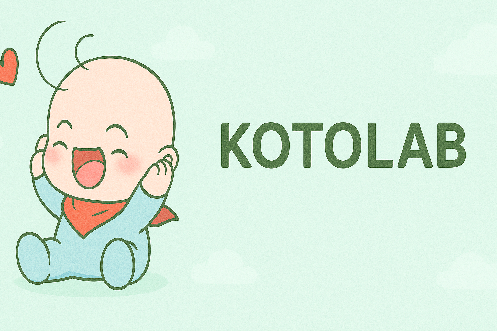
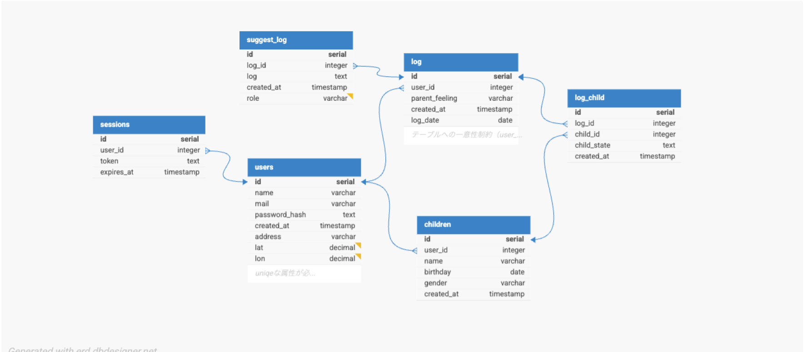
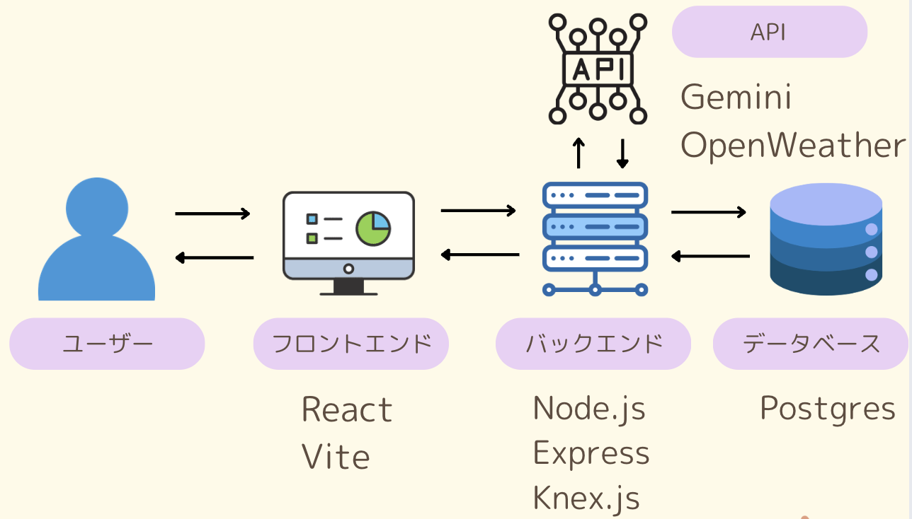

# 🍼 子育て支援アプリ「kotolab」



休日どこでかけていいかわからない親の皆様に自身の体調や子供の様子を記録することで AI が最適な休日プランを提供します！！
スマートフォンでも快適に利用できる PWA（Progressive Web App）対応してます

構成は下記です。

```
KOTOLAB/
├── client/           # React+vite フロントエンド
├── server/           # Node.js + Express バックエンドAPI + postgreDB
└── README.md
```

## アプリ概要

子どもとの外出時にこんなことはありませんか？

- 毎回予定を考えるのが大変で、やることがルーチン化する
- 急な予定変更時に別の予定を考えるのが大変

今回継承したアプリでは、天気や気温、親の気分、子どもの様子から、親子のためのちょうどいい過ごし方を AI が提案します！！

## 🖥 使用技術

- フロントエンド React,vite
- バックエンド Node.js, Express, Knex.js, PostgreSQL
- その他 GeminiAPI, OpenWeatherMap API, Google 認証

## ER 図



## 🗺️ アーキテクチャ図



## 🚀 起動方法

- [ ] このレポジトリをクローンした後、 `npm install` を実行して必要なパッケージをインストールしてください。
- [ ] 次の作業では、 `npm run build` を実行して client ディレクトリにあるコードを`public`にビルドします。
- [ ] 次の作業では、ローカル環境で Postgres が起動している必要があります。Postgres のインスタンスを起動し、`kotolab` という名前のデータベースを作成してください。
  > **補足**: データベースを作成するための `psql` クエリは `CREATE DATABASE kotolab;` です。
- [ ] 次の作業では、`.env`ファイルを作成し以下の環境変数を設定してください

/client/.env

```
VITE_BACKEND_URL=http://localhost:3000
```

/server/.env

```
NODE_ENV=development
POSTGRES_USER=<yourusername> //DB作成時のユーザーネームです。


//以下はGoogle Cloud Consoleから取得
GOOGLE_CLIENT_ID=
GOOGLE_CLIENT_SECRET=
GOOGLE_CALLBACK_URL=
GOOGLE_CALLBACK_URL=http://localhost:3000/api/auth/google/callback


FRONT_URL=http://localhost:3000/

//以下はGeminiAPIから取得
GEMINI_API=

//以下はOpenWeatherMapAPIから取得
WEATHER_API=

```

- [ ] `npm run dev` を使ってアプリを起動し、ブラウザで `localhost` にアクセスしてください（ポート番号は `index.js` に記載されています）。

## 🔄 機能一覧

- AI 提案をモード選択　(おまかせ・アクティブ・おうち・屋内)
- AI から下記の情報を元に今日の予定内容提案&再提案

  - 親&子のの状態管理(親の感情&子供の様子&子供の年齢)
  - 天気情報
  - 登録地の緯度経度
  - 提案モード

- ユーザー登録&ログイン機能(Google 認証でのログイン機能)
- PWA に対応(スマホ対応)
- 子供の任意登録
- 天気情報表示
- 登録地の緯度経度取得

## 🤔 今後追加予定機能

- 現在地/訪問先の緯度経度から予定の提案
- 1 週間の天気予報
- 過去データリセット
- 訪問者選択機能
- AI からの提案履歴表示

[](https://skillicons.dev)
